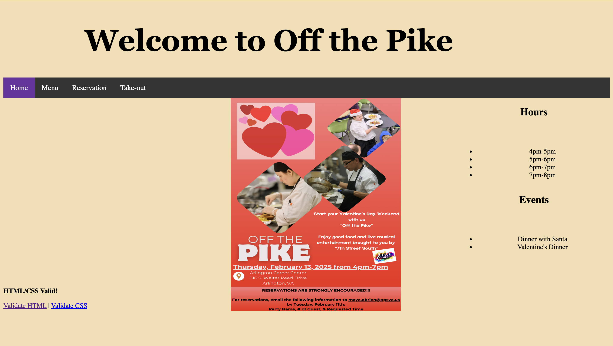
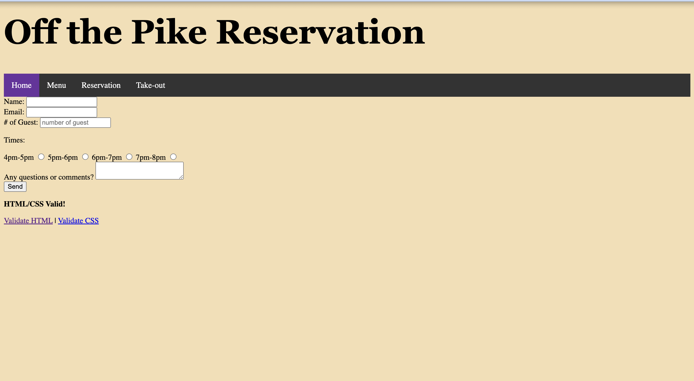

# These are my Off the Pike webiste pages

[Link to website](https://tai-yuwang.github.io/Best_Table.github.io/group_2/index.html)
[Link to repo](https://github.com/Tai-YuWang/Best_Table.github.io)

 
### My form was the reservation form to help manage the tables faster. My request method was POST and I used the action "submit-contact" and my inputs were "text" for the name,"email" for the email,"number" for the phone number, and "radio" for the single-select questions" 

### The process of sharing a code and pulling and pushing wasn't that bad since we both stayed in our own pages but when it came to the styles or other miscommunitcations, it was a bit of a stuggle.  
